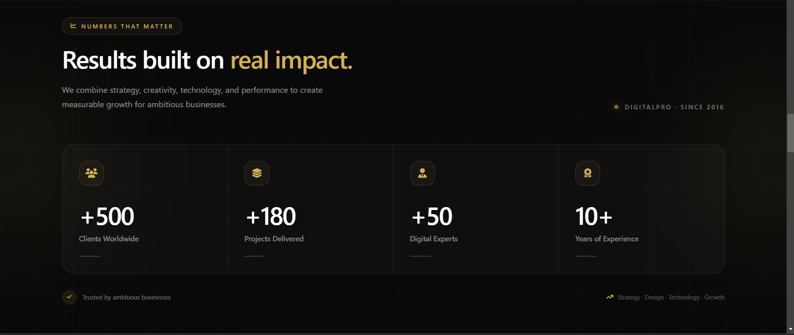
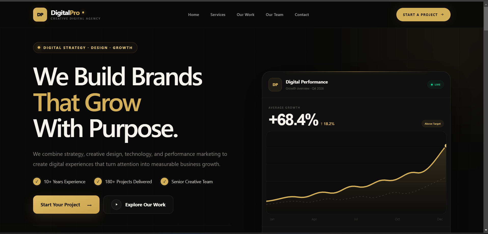

# DigitalPro — Creative Digital Agency

<p align="center">
  
</p>

<h3 align="center">A Premium, Responsive Digital Agency Website</h3>

<p align="center">
  A modern dark-themed agency website built with HTML5, Tailwind CSS, JavaScript, and Font Awesome.
</p>

<p align="center">
  <a href="#overview">Overview</a> •
  <a href="#features">Features</a> •
  <a href="#sections">Sections</a> •
  <a href="#tech-stack">Tech Stack</a> •
  <a href="#getting-started">Getting Started</a>
</p>

---

## ✦ Overview

**DigitalPro** is a premium fictional digital agency website created to showcase a complete modern agency experience — from the first impression in the hero section to services, measurable results, team expertise, and project inquiries.

The design is built around a refined **black, charcoal, ivory, and gold** visual identity with subtle glass surfaces, ambient glows, interactive states, and conversion-focused layouts.

> **Design principle:** Make the interface feel premium without making it complicated.

---

## 🎬 Project Showcase

<p align="center">
  <a href="output/output.mp4">
    
  </a>
</p>

<p align="center">
  <strong>▶ Click the preview above to open the project showcase video.</strong>
</p>

> The showcase video is stored in `output/output.mp4`.

---

## 🖥️ Screenshots

### Main Website Preview

<p align="center">
  
</p>

### Additional Preview

<p align="center">
  
</p>

---

# ✨ Features

- Premium dark/gold visual identity
- Fixed responsive navigation
- Responsive mobile menu
- Interactive hero section
- Digital performance dashboard
- Service cards with hover interactions
- Results and statistics section
- Creative team showcase
- Contact form
- Contact information panel
- Map-inspired location card
- Social media links
- Premium CTA sections
- Font Awesome icons
- Tailwind-only UI styling
- Responsive layouts for mobile, tablet, and desktop
- Subtle glow, blur, border, and elevation effects
- Conversion-focused user journey

---

# 🧩 Website Sections

## 01 — Fixed Navigation

The navigation keeps the original reference idea while using the DigitalPro identity:

```text
DP  DigitalPro
    Creative Digital Agency

Home   Services   Our Work   Our Team   Contact

                         [ Start a Project ]
```

Features:

- Custom `DP` logo mark
- White + gold DigitalPro wordmark
- Fixed positioning
- Dark glass effect
- Responsive mobile menu
- Gold hover indicators
- Primary project CTA

---

## 02 — Hero

The hero introduces the agency with:

> **We Build Brands That Grow With Purpose.**

It combines creative messaging with a performance dashboard to communicate both design quality and measurable business impact.

Example metrics:

```text
10+   Years of Experience
180+  Projects Delivered
96%   Client Retention
68.4% Growth
4.8x  ROAS
8.7%  Conversion Rate
124%  Organic Traffic
```

---

## 03 — Services

DigitalPro provides a complete digital service ecosystem:

- Digital Strategy & Consulting
- Performance Marketing
- Web Design & Development
- SEO & Organic Growth
- Brand Identity & Creative
- AI Automation & Solutions

Service cards use responsive grids, hover elevation, gold accents, supporting metrics, and interactive visual elements.

---

## 04 — Results & Statistics

The statistics section transforms simple numbers into interactive premium cards:

```text
+500
Clients Worldwide

+180
Projects Delivered

+50
Digital Experts

10+
Years of Experience
```

Each card includes a Font Awesome icon, hover glow, animated indicator, and responsive layout.

---

## 05 — Creative Team

The team section presents a multidisciplinary agency team with roles such as:

- Marketing Director
- SEO Strategist
- Lead Developer
- Creative Director

Each profile includes:

- Role
- Experience
- Expertise
- Availability indicator
- Social links
- Font Awesome icons
- Hover animations

The displayed names and figures are sample content for the fictional DigitalPro concept.

---

## 06 — Contact

The contact section is designed as the main conversion point.

### Form fields

- Full Name
- Email Address
- Company / Brand
- Service Selection
- Project Details

### Contact information

```text
Cairo, Egypt
+21000907482
baselamr52@gmail.com
Sun – Thu · 9:00 AM – 6:00 PM
```

The contact details are sample project data and should be replaced before production use.

---

## 07 — Footer

The footer includes:

- DigitalPro branding
- Agency description
- Main navigation
- Social links
- Privacy Policy
- Terms of Service
- Copyright information

---

# 🎨 Design System

| Element | Value / Direction |
|---|---|
| Primary Background | `#090909` |
| Secondary Background | `#111111` |
| Primary Accent | `#d4af5a` |
| Accent Hover | `#e3c477` |
| Main Text | `#ffffff` |
| Secondary Text | Muted white / gray |
| Cards | Dark translucent surfaces |
| Borders | Subtle white / gold |
| Icons | Font Awesome |
| Styling | Tailwind CSS |

The limited palette keeps the interface cohesive and gives the project a premium agency character.

---

# 🛠️ Tech Stack

### Frontend

- HTML5
- Tailwind CSS
- JavaScript
- Font Awesome

### UI Techniques

- CSS Grid through Tailwind utilities
- Flexbox
- Responsive breakpoints
- Backdrop blur
- Gradients
- Transitions
- Hover states
- Focus states
- Transform animations
- Accessible semantic HTML

### Icons

[Font Awesome](https://fontawesome.com/)

Font Awesome is used consistently instead of manually typed Unicode symbols.

---

# 📱 Responsive Design

The interface is designed for:

```text
📱 Mobile
   ↓
📱 Large Mobile
   ↓
💻 Tablet
   ↓
🖥️ Desktop
   ↓
🖥️ Large Desktop
```

Responsive behavior includes:

- One-column mobile layouts
- Two-column tablet layouts
- Multi-column desktop layouts
- Mobile navigation
- Responsive typography
- Responsive spacing
- Flexible CTA layouts

---

# ⚡ Interaction & UX

The website uses small interactions to create a polished experience.

### Cards

On hover:

- Cards lift
- Gold borders become more visible
- Icons scale
- Text highlights
- Glow becomes stronger
- Secondary elements appear

### Buttons

Primary buttons use:

- Gold backgrounds
- Dark text
- Arrow movement
- Hover elevation
- Gold shadows

### Form Inputs

Inputs include:

- Dark glass surfaces
- Gold focus borders
- Gold focus glow
- Font Awesome field icons
- Accessible labels

---

# 📂 Project Structure

Recommended structure:

```text
DigitalPro/
│
├── index.html
│
├── js/
│   └── script.js
│
├── output/
│   ├── 1.png
│   ├── 2.png
│   └── output.mp4
│
├── assets/
│   ├── images/
│   └── icons/
│
└── README.md
```

---

# 🚀 Getting Started

## 1. Clone the repository

```bash
git clone https://github.com/Basel-Amr/SEF-Academy-Project-03-Digital-Pro-Marketing-.git
```

## 2. Open the project

```bash
cd DigitalPro
```

## 3. Run the website

Open `index.html` directly in your browser, or use a local development server such as **VS Code Live Server**.

---

# 🔧 Customization

### Brand

Change:

```text
DigitalPro
```

### Gold accent

```text
#d4af5a
```

### Contact information
```text
Cairo, Egypt
+201000907482
baselamr52@gmail.com
```

### Team

Replace the sample team names, roles, experience, and social links with your actual content.

### Portfolio

Replace the sample project media with your own screenshots, case studies, and project videos.

---

# 📊 Project Goals

This project demonstrates practical frontend development skills including:

- Building a complete agency landing page
- Creating a consistent design system
- Implementing responsive layouts
- Using Tailwind CSS efficiently
- Creating interactive UI states
- Designing conversion-focused sections
- Building responsive navigation
- Creating contact forms
- Organizing a professional frontend project
- Presenting a project professionally on GitHub

---

# 💡 Design Philosophy

The page follows a simple user journey:

```text
Hero
  ↓
Create Attention
  ↓
Services
  ↓
Explain Value
  ↓
Results
  ↓
Build Credibility
  ↓
Team
  ↓
Humanize The Agency
  ↓
Contact
  ↓
Convert Interest Into Action
```

The result is a website that combines **visual storytelling, business credibility, and a clear conversion path**.

---

# 🌟 Project Highlights

```text
✓ Premium dark/gold interface
✓ Fixed navigation
✓ Responsive mobile navigation
✓ Interactive hero dashboard
✓ Service ecosystem
✓ Results statistics
✓ Creative team showcase
✓ Contact form
✓ Location panel
✓ Social media integration
✓ Font Awesome icon system
✓ Tailwind CSS implementation
✓ Hover micro-interactions
✓ Responsive design
✓ Conversion-focused CTAs
```

---

# 📸 Media

All project media is stored in:

```text
output/
├── 1.png
├── 2.png
└── output.mp4
```

### Images

```markdown


```

### Video

```text
output/output.mp4
```

---

# 👨‍💻 Author

## Basel Amr Barakat

Electrical Engineering graduate specialized in **Computer and Control**, with interests across:

- Frontend Development
- Full Stack Development
- Artificial Intelligence
- Embedded Systems
- Computer Vision
- Machine Learning
- RAG & LLM Applications
- Modern Web Experiences

This project was created as a practical demonstration of modern frontend development, UI design, responsive implementation, and professional project presentation.

---

# 📬 Contact

Interested in collaborating or discussing a project?

**DigitalPro**  
Cairo, Egypt

```text
Email: baselamr52@gmail.com
Phone: +201000907482
```

---

# ⭐ Support

If you find this project useful or inspiring, consider giving the repository a ⭐ on GitHub.

---

<p align="center">
  <strong>DigitalPro</strong>
  <br>
  <sub>Strategy · Design · Technology · Growth</sub>
</p>

<p align="center">
  Built with precision, creativity, and a focus on measurable digital impact.
</p>
